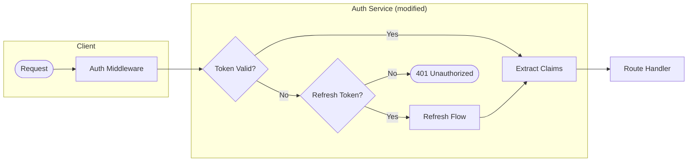

# Mermaid Diagram Generator

Generate clear, verifiable Mermaid diagrams that balance high-level understanding with enough detail to confirm correctness.

## User Request

$ARGUMENTS

If `$ARGUMENTS` is empty, ask: "What should I diagram? Options: `--branch` (changes on this branch), `--system <target>` (specific system/flow), or describe what you want to visualize."

## Modes

- `--branch`: Analyze changes on current branch vs main. Produce data flow diagram showing how data moves through the changed code.
- `--system <target>`: Analyze a specific system, module, or flow. `<target>` can be a file path, directory, function name, or concept (e.g., "auth flow", "payment processing").
- **Freeform**: Any other input is treated as a description of what to diagram.

## Workflow

### 1. Gather Context

**For `--branch`:**
```bash
BASE=$(git merge-base origin/main HEAD 2>/dev/null || git merge-base origin/master HEAD)
git diff --stat $BASE..HEAD
git diff $BASE..HEAD
```

**For `--system <target>`:**
- Locate relevant files using grep/glob
- Read entry points, core logic, and data models
- Trace the flow through the system

**For freeform:**
- Parse the description to understand what needs diagramming
- Gather relevant code context

### 2. Analyze & Design

Identify:
- **Entry points**: Where data/control enters
- **Transformations**: What happens to data at each step
- **Decision points**: Branches, conditions, error paths
- **Exit points**: Where data/control leaves (returns, side effects, external calls)
- **Key actors**: Services, modules, functions, external systems

### 3. Select Diagram Type

Choose the most appropriate type:

| Type | Use When |
|------|----------|
| `flowchart TD` | Control flow, decision trees, process steps |
| `flowchart LR` | Data pipelines, request/response flows |
| `sequenceDiagram` | Multi-actor interactions, API calls, async flows |
| `stateDiagram-v2` | State machines, lifecycle, status transitions |
| `classDiagram` | Data models, relationships, inheritance |
| `erDiagram` | Database schemas, entity relationships |

Default to `flowchart LR` for data flow unless another type is clearly better.

### 4. Diagram Style Rules

**Clarity over completeness:**
- Max 15-20 nodes per diagram. Split into multiple diagrams if needed.
- Use descriptive but concise labels (verb + noun: "Validate Input", "Fetch User")
- Group related nodes with subgraphs when it aids understanding

**Detail level:**
- Include function/file names where they help verification
- Show data shape at key boundaries (e.g., `{userId, token}`)
- Mark external systems distinctly (use `[(Database)]` or `{{External API}}`)

**Visual conventions:**
```
[Rectangle] - Process/function
([Stadium]) - Start/end points
{Diamond} - Decision
[(Cylinder)] - Database/storage
{{Hexagon}} - External service
[[Subroutine]] - Reusable component
```

**Edge labels:**
- Label edges with data being passed or condition
- Use dotted lines `-.->` for optional/async paths
- Use thick lines `==>` for primary/happy path

### 5. Output

Generate a markdown file with:

1. **Title**: What this diagram shows
2. **Scope**: What's included/excluded
3. **Diagram(s)**: The Mermaid code block(s)
4. **Legend** (if needed): Explain non-obvious symbols
5. **Notes**: Key assumptions, simplifications, or areas needing attention

**Output location**: `context/diagrams/<name>.md`

Where `<name>` is derived from the mode:
- `--branch`: `branch-<branch-name>-dataflow.md`
- `--system`: `system-<target-slug>.md`
- Freeform: `diagram-<slug>.md`

## Example Output Structure

```markdown
# Data Flow: Authentication Changes

**Scope**: Changes introduced in `feature/oauth-refresh` branch affecting auth flow.

## Request Flow



## Notes

- Refresh flow is new in this branch
- Token validation logic moved from middleware to service
```

## Final Checklist

Before outputting:
- [ ] Diagram is readable without zooming
- [ ] All nodes are reachable (no orphans)
- [ ] Primary path is visually distinct
- [ ] File/function references are accurate and verifiable
- [ ] Complexity matches the scope (don't over-simplify branch changes, don't over-detail high-level system views)

Now execute based on the user request above.
